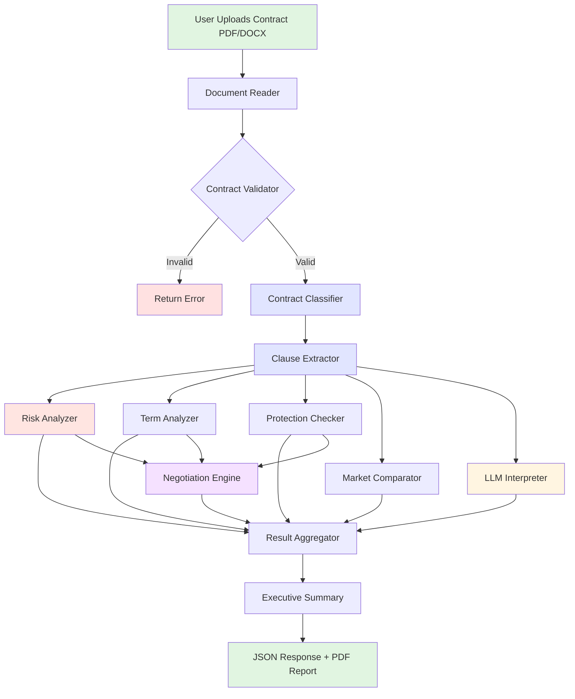
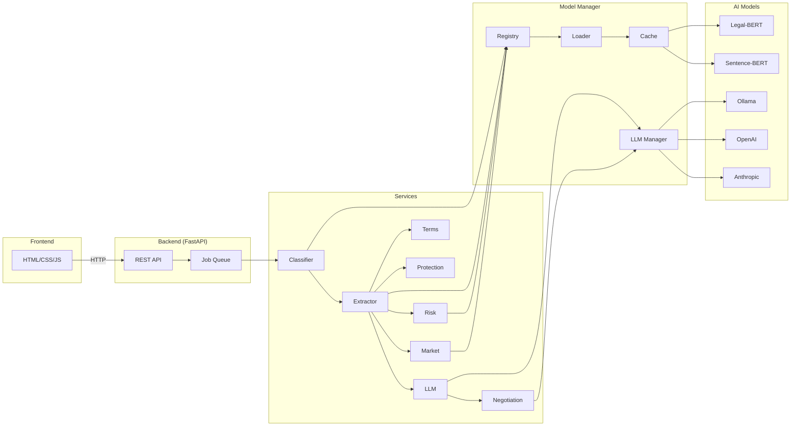

<div align="center">

# AI Contract Risk Analyzer 🤖⚖️

[](https://www.python.org/downloads/)
[](https://fastapi.tiangolo.com/)
[](https://opensource.org/licenses/MIT)
[](http://makeapullrequest.com)

> **Democratizing Legal Intelligence Through AI**  
> Comprehensive contract risk analysis using Legal-BERT, multi-model NLP, and LLM integration

</div>


## 🎯 Overview

The AI Contract Risk Analyzer is a production-grade legal document analysis platform that leverages state-of-the-art NLP and machine learning to provide instant, comprehensive contract risk assessment. Built with Legal-BERT for clause understanding, semantic embeddings for similarity matching, and LLM integration for natural language explanations.

### Key Features

- 📄 **Multi-Format Support**: PDF, DOCX document processing
- 🔍 **12+ Contract Categories**: Employment, NDA, Lease, Service agreements, etc.
- ⚡ **Sub-30s Analysis**: Real-time risk scoring and clause extraction
- 🔒 **Privacy-First**: Ephemeral processing, zero data retention
- 🌐 **LLM Integration**: Ollama, OpenAI, Anthropic support
- 📊 **Comprehensive Reports**: Executive summaries, negotiation points, market comparisons

---

## 📋 Table of Contents

- [Architecture](#-architecture)
- [Installation](#-installation)
- [Quick Start](#-quick-start)
- [API Documentation](#-api-documentation)
- [Technical Details](#-technical-details)
- [Configuration](#-configuration)
- [Development](#-development)
- [Performance](#-performance)
- [License](#-license)

---

## 🏗️ Architecture

### System Overview

```
┌─────────────────────────────────────────────────────────────┐
│                      Client Layer                           │
│  (Browser / Mobile / CLI / API Client)                      │
└──────────────────────┬──────────────────────────────────────┘
                       │ REST API
┌──────────────────────▼──────────────────────────────────────┐
│                  FastAPI Backend                            │
│  ┌──────────────────────────────────────────────────────┐  │
│  │ Routes: /analyze, /jobs/{id}, /validate, /health    │  │
│  │ Async Processing: BackgroundTasks + Job Queue       │  │
│  │ Middleware: CORS, Error Handling, Logging           │  │
│  └──────────────────────────────────────────────────────┘  │
└──────────────────────┬──────────────────────────────────────┘
                       │
┌──────────────────────▼──────────────────────────────────────┐
│              Services Orchestration Layer                   │
│  ┌─────────────┐  ┌──────────────┐  ┌─────────────────┐   │
│  │ Classifier  │──▶│ Clause       │──▶│ Risk Analyzer   │   │
│  │ (Legal-BERT)│  │ Extractor    │  │ (Multi-Factor)  │   │
│  └─────────────┘  └──────────────┘  └─────────────────┘   │
│  ┌─────────────┐  ┌──────────────┐  ┌─────────────────┐   │
│  │ Term        │  │ Protection   │  │ Market          │   │
│  │ Analyzer    │  │ Checker      │  │ Comparator      │   │
│  └─────────────┘  └──────────────┘  └─────────────────┘   │
│  ┌─────────────┐  ┌──────────────┐                         │
│  │ LLM         │  │ Negotiation  │                         │
│  │ Interpreter │  │ Engine       │                         │
│  └─────────────┘  └──────────────┘                         │
└──────────────────────┬──────────────────────────────────────┘
                       │
┌──────────────────────▼──────────────────────────────────────┐
│                Model Management Layer                       │
│  ┌─────────────────────────────────────────────────────┐   │
│  │ Model Registry (Singleton, Thread-Safe)             │   │
│  │ - LRU Cache Eviction                                │   │
│  │ - GPU/CPU Auto-Detection                            │   │
│  │ - Lazy Loading                                      │   │
│  └─────────────────────────────────────────────────────┘   │
│  ┌─────────────────────────────────────────────────────┐   │
│  │ LLM Manager (Multi-Provider)                        │   │
│  │ - Ollama (Local, Free)                              │   │
│  │ - OpenAI (GPT-3.5/4)                                │   │
│  │ - Anthropic (Claude)                                │   │
│  │ - Auto-Fallback & Rate Limiting                     │   │
│  └─────────────────────────────────────────────────────┘   │
└──────────────────────┬──────────────────────────────────────┘
                       │
┌──────────────────────▼──────────────────────────────────────┐
│                   AI Models Layer                           │
│  ┌──────────────────────────────────────────────────────┐  │
│  │ Legal-BERT (nlpaueb/legal-bert-base-uncased)        │  │
│  │ - Domain-adapted BERT for legal text                │  │
│  │ - 110M parameters, 768-dim embeddings               │  │
│  │ - Fine-tuned on 12GB legal corpus                   │  │
│  └──────────────────────────────────────────────────────┘  │
│  ┌──────────────────────────────────────────────────────┐  │
│  │ Sentence-BERT (all-MiniLM-L6-v2)                    │  │
│  │ - 22M parameters, 384-dim embeddings                │  │
│  │ - Semantic similarity engine                        │  │
│  └──────────────────────────────────────────────────────┘  │
└─────────────────────────────────────────────────────────────┘
```

### Analysis Pipeline Flowchart



### Component Diagram



---

## 🚀 Installation

### Prerequisites

```bash
# System Requirements
Python: 3.10 or higher
RAM: 16GB recommended (8GB minimum)
Storage: 10GB for models
GPU: Optional (3x speedup with NVIDIA GPU + CUDA 11.8+)
```

### Option 1: Quick Install (Recommended)

```bash
# Clone repository
git clone https://github.com/itobuztech/contract-guard-ai.git
cd contract-guard-ai

# Create virtual environment
python -m venv venv
source venv/bin/activate  # On Windows: venv\Scripts\activate

# Install dependencies
pip install -r requirements.txt

# Download spaCy model (optional, for advanced text processing)
python -m spacy download en_core_web_sm

# Download AI models (automatic on first run, or manual)
python -c "from model_manager.model_loader import ModelLoader; ModelLoader()"
```

### Option 2: Docker Installation

```bash
# Build Docker image
docker build -t contract-analyzer .

# Run container
docker run -p 8000:8000 -v ./models:/app/models contract-analyzer

# With GPU support
docker run --gpus all -p 8000:8000 -v ./models:/app/models contract-analyzer
```

### Option 3: Development Setup

```bash
# Install in editable mode with dev dependencies
pip install -e ".[dev]"

# Install pre-commit hooks
pre-commit install

# Run tests
pytest tests/

# Run linting
flake8 .
black .
mypy .
```

---

## ⚡ Quick Start

### 1. Start Required Services

```bash
# Terminal 1: Start Ollama (for LLM features)
ollama serve

# Pull LLM model
ollama pull llama3:8b
```

### 2. Configure Environment

```bash
# Copy example environment file
cp .env.example .env

# Edit .env with your settings
nano .env
```

```env
# .env file
APP_NAME="AI Contract Risk Analyzer"
HOST="0.0.0.0"
PORT=8000

# Ollama (Local LLM - Free)
OLLAMA_BASE_URL="http://localhost:11434"
OLLAMA_MODEL="llama3:8b"

# Optional: OpenAI (for premium LLM features)
OPENAI_API_KEY="sk-..."

# Optional: Anthropic (for premium LLM features)
ANTHROPIC_API_KEY="sk-ant-..."

# Analysis Configuration
MAX_CLAUSES_TO_ANALYZE=15
MIN_CONTRACT_LENGTH=300
```

### 3. Launch Application

```bash
# Option A: Use launch script (starts API + Frontend)
python launch.py

# Option B: Start API only
python app.py

# Option C: Use Uvicorn directly
uvicorn app:app --reload --host 0.0.0.0 --port 8000
```

### 4. Access Services

- **API**: http://localhost:8000
- **Interactive Docs**: http://localhost:8000/api/docs
- **Health Check**: http://localhost:8000/api/v1/health

### 5. Analyze Your First Contract

```bash
# Using cURL
curl -X POST "http://localhost:8000/api/v1/analyze" \
  -F "file=@/path/to/contract.pdf" \
  -F "max_clauses=15" \
  -F "interpret_clauses=true" \
  -F "llm_provider=ollama"

# Response (job created)
{
  "job_id": "abc-123-def-456",
  "status": "pending",
  "progress": 0,
  "message": "Analysis queued"
}

# Check status
curl "http://localhost:8000/api/v1/jobs/abc-123-def-456"

# Response (completed)
{
  "job_id": "abc-123-def-456",
  "status": "completed",
  "progress": 100,
  "result": {
    "overall_score": 78,
    "risk_level": "HIGH",
    "clauses": [...],
    "unfavorable_terms": [...],
    ...
  }
```

---

## 📚 API Documentation

### Core Endpoints

#### 1. Analyze Contract (Async)

```bash
POST /api/v1/analyze
Content-Type: multipart/form-data

Parameters:
  - file: File (required) - PDF or DOCX contract
  - max_clauses: int (default: 15) - Max clauses to extract
  - interpret_clauses: bool (default: true) - Generate plain-English explanations
  - generate_negotiation_points: bool (default: true) - Create negotiation strategy
  - compare_to_market: bool (default: true) - Compare to market standards
  - llm_provider: str (default: "ollama") - LLM provider: ollama/openai/anthropic

Response: 202 Accepted
{
  "job_id": "uuid",
  "status": "pending",
  "progress": 0,
  "message": "Analysis queued",
  "created_at": "ISO-8601 timestamp"
}
```

#### 2. Get Job Status

```bash
GET /api/v1/jobs/{job_id}

Response: 200 OK
{
  "job_id": "uuid",
  "status": "completed",  // pending/processing/completed/failed
  "progress": 100,
  "message": "Analysis complete",
  "result": {
    "analysis_id": "uuid",
    "timestamp": "ISO-8601",
    "classification": {...},
    "clauses": [...],
    "risk_analysis": {...},
    "unfavorable_terms": [...],
    "missing_protections": [...],
    "clause_interpretations": [...],
    "negotiation_points": [...],
    "market_comparisons": [...],
    "executive_summary": "text",
    "metadata": {...}
  }
```

#### 3. Health Check

```bash
GET /api/v1/health

Response: 200 OK
{
  "status": "healthy",
  "version": "1.0.0",
  "timestamp": "ISO-8601",
  "models_loaded": 2,
  "gpu_available": true
}
```

### Response Schemas

<details>
<summary><b>Complete Analysis Result Schema</b></summary>

```json
{
  "analysis_id": "uuid",
  "timestamp": "2025-01-15T10:30:00.000Z",
  
  "classification": {
    "category": "employment",
    "subcategory": "full_time",
    "confidence": 0.89,
    "reasoning": ["Strong keyword match", "Semantic similarity 0.87"],
    "detected_keywords": ["employee", "salary", "benefits"],
    "alternative_categories": [
      {"category": "consulting", "confidence": 0.43}
    ]
  },
  
  "clauses": [
    {
      "text": "Employee shall not engage in competitive business...",
      "reference": "Section 8.2",
      "category": "non_compete",
      "confidence": 0.92,
      "start_pos": 5432,
      "end_pos": 5680,
      "extraction_method": "structural",
      "risk_indicators": ["non-compete", "competitive"],
      "subclauses": [],
      "legal_bert_score": 0.88
    }
  ],
  
  "risk_analysis": {
    "overall_score": 78,
    "risk_level": "HIGH",
    "category_scores": {
      "restrictive_covenants": 85,
      "termination_rights": 72,
      "penalties_liability": 68
    },
    "risk_factors": ["restrictive_covenants"],
    "detailed_findings": {
      "restrictive_covenants": [
        "Duration of 24 months is excessive"
      ]
    },
    "benchmark_comparison": {
      "non_compete_duration": "✗ Exceeds market standards"
    },
    "risk_breakdown": [
      {
        "category": "Restrictive Covenants",
        "score": 85,
        "summary": "Analysis of non-compete clauses",
        "findings": ["Duration 24 months excessive"]
      }
    ]
  },
  
  "unfavorable_terms": [
    {
      "term": "Non Compete Overly Broad",
      "category": "non_compete",
      "severity": "critical",
      "explanation": "Restricts ability to earn living",
      "clause_reference": "Section 8.2",
      "suggested_fix": "Limit to 6-12 months, direct competitors only"
    }
  ],
  
  "missing_protections": [
    {
      "protection": "'For Cause' Definition",
      "importance": "critical",
      "explanation": "Termination grounds are ambiguous",
      "recommendation": "Add clear 'for cause' definition",
      "category": "termination",
      "examples": ["For Cause means: gross negligence, breach..."]
    }
  ],
  
  "clause_interpretations": [
    {
      "clause_reference": "Section 8.2",
      "original_text": "Employee shall not engage...",
      "plain_english_summary": "Prevents working for competitors",
      "key_points": [
        "Restricts future employment",
        "Duration and scope are key factors"
      ],
      "potential_risks": [
        "Could prevent earning a living in your field",
        "24-month duration is excessive"
      ],
      "favorability": "unfavorable",
      "confidence": 0.85
    }
  ],
  
  "negotiation_points": [
    {
      "priority": 1,
      "category": "non_compete",
      "issue": "Non Compete Overly Broad",
      "current_language": "Employee shall not engage in any competitive business for 24 months globally...",
      "proposed_language": "Employee agrees not to work for direct competitors in software industry within 50 miles for 6 months...",
      "rationale": "Current terms unreasonably restrict ability to earn living",
      "fallback_position": "If 6 months refused, negotiate to 12 months maximum",
      "estimated_difficulty": "hard"
    }
  ],
  
  "market_comparisons": [
    {
      "clause_category": "non_compete",
      "user_clause": "Employee shall not engage in any competitive business for 24 months...",
      "market_standard": "Employee shall not engage in competitive activities for 12 months within geographic area...",
      "similarity_score": 0.68,
      "assessment": "unfavorable",
      "explanation": "More aggressive than market standards",
      "recommendation": "Strongly recommend negotiating to align with market norms"
    }
  ],
  
  "executive_summary": "This employment contract has been analyzed and assigned an overall risk score of 78/100, classified as HIGH risk. SIGNIFICANT CONCERNS: This contract has several unfavorable terms that should be negotiated before execution...",
  
  "metadata": {
    "text_length": 15432,
    "word_count": 2876,
    "num_clauses": 12,
    "contract_type": "employment",
    "options": {
      "max_clauses": 15,
      "interpret_clauses": true,
      "generate_negotiation_points": true,
      "compare_to_market": true,
      "llm_provider": "ollama"
    }
  }
}
```

</details>

---

## 🔧 Technical Details

### Core Technologies

#### AI/ML Stack
```python
# Legal Language Models
Legal-BERT: nlpaueb/legal-bert-base-uncased  # 110M params, 768-dim
Sentence-BERT: all-MiniLM-L6-v2              # 22M params, 384-dim

# LLM Integration
Ollama: llama3:8b (local, free)
OpenAI: gpt-3.5-turbo, gpt-4
Anthropic: claude-3-sonnet, claude-3-opus

# Deep Learning Framework
PyTorch: 2.1+
Transformers: 4.35+ (Hugging Face)
```

#### Backend Stack
```python
# API Framework
FastAPI: 0.104+ (async, type-safe)
Uvicorn: ASGI server (1000+ req/sec)
Pydantic: 2.5+ (data validation)

# Document Processing
PyMuPDF: 1.23+ (superior PDF extraction)
PyPDF2: 3.0+ (fallback PDF reader)
python-docx: 1.1+ (Word documents)

# Async & Performance
aiofiles: async file I/O
asyncio: concurrent processing
```

### Project Structure

```
contract-guard-ai/
│
├── app.py                      # FastAPI application (main entry)
├── requirements.txt            # Python dependencies
├── .env.example                # Environment variables template
├── README.md                   # This file
│
├── config/                     # Configuration management
│   ├── __init__.py
│   ├── settings.py             # App settings (FastAPI config)
│   ├── model_config.py         # Model paths and configurations
│   └── risk_rules.py           # Risk scoring rules and weights
│
├── model_manager/              # Model loading and caching
│   ├── __init__.py
│   ├── model_loader.py         # Lazy model loading
│   ├── model_registry.py       # Singleton registry with LRU cache
│   ├── model_cache.py          # Disk-based caching
│   └── llm_manager.py          # Multi-provider LLM integration
│
├── services/                   # Business logic services
│   ├── __init__.py
│   ├── contract_classifier.py  # Contract type classification
│   ├── clause_extractor.py     # Clause extraction (Legal-BERT)
│   ├── risk_analyzer.py        # Multi-factor risk scoring
│   ├── term_analyzer.py        # Unfavorable terms detection
│   ├── protection_checker.py   # Missing protections checker
│   ├── llm_interpreter.py      # LLM-powered clause interpretation
│   ├── negotiation_engine.py   # Negotiation points generation
│   └── market_comparator.py    # Market standards comparison
│
├── utils/                      # Utility functions
│   ├── __init__.py
│   ├── document_reader.py      # PDF/DOCX text extraction
│   ├── text_processor.py       # NLP preprocessing
│   ├── validators.py           # Contract validation
│   └── logger.py               # Structured logging
│
├── models/                     # Downloaded AI models (cached)
│   ├── legal-bert/
│   └── embeddings/
│
├── cache/                      # Runtime cache
│   └── models/
│
├── logs/                       # Application logs
│   ├── contract_analyzer.log
│   ├── contract_analyzer_error.log
│   └── contract_analyzer_performance.log
│
├── static/                     # Frontend files
│   └── index.html
│
├── uploads/                    # Temporary upload storage
│
└── docs/                       # Documentation
   └── BLOGPOST.md
```

### Mathematical Foundations

#### Risk Scoring Algorithm

```python
# Overall risk score calculation
R_overall = Σ (α_i × r_i)  for i in [1, n]


Where:
  α_i = weight for risk category i (Σα_i = 1)
  r_i = risk score for category i ∈ [0, 100]

# Category risk score
r_i = f(keyword_score, pattern_score, clause_score, missing_score, benchmark_score)

# Weighted combination
if has_clauses:
    r_i = (0.50 × clause_score +
           0.20 × keyword_score +
           0.15 × pattern_score +
           0.15 × missing_score
          )

else:
    r_i = (0.40 × keyword_score +
           0.35 × pattern_score +
           0.25 × missing_score
          )
```

#### Semantic Similarity

```python
# Cosine similarity for clause comparison
sim(clause1, clause2) = cos(e1, e2)
                      = (e1 · e2) / (||e1|| × ||e2||)

Where:
  e1, e2 = SBERT embeddings ∈ R^384
  · = dot product
  ||·|| = L2 norm
```

#### Confidence Calibration (Platt Scaling)

```python
# Calibrated probability
P(correct | score) = 1 / (1 + exp(A × score + B))

Where:
  A, B  = parameters learned from validation data
  score = raw model confidence
```

### Memory Usage

```
Legal-BERT Model: ~450MB
Sentence-BERT Model: ~100MB
LLM Manager: ~50MB
Total (Idle): ~600MB
Total (Peak): ~1.2GB
```

---

## ⚙️ Configuration

### Application Settings (config/settings.py)

```python
from pydantic_settings import BaseSettings

class Settings(BaseSettings):
    # Application
    APP_NAME: str = "AI Contract Risk Analyzer"
    APP_VERSION: str = "1.0.0"
    HOST: str = "0.0.0.0"
    PORT: int = 8000
    RELOAD: bool = False  # Set to True for development
    WORKERS: int = 4
    LOG_LEVEL: str = "INFO"
    
    # CORS
    CORS_ORIGINS: list = ["*"]
    CORS_ALLOW_CREDENTIALS: bool = True
    CORS_ALLOW_METHODS: list = ["*"]
    CORS_ALLOW_HEADERS: list = ["*"]
    
    # File Upload
    MAX_UPLOAD_SIZE: int = 10 * 1024 * 1024  # 10MB
    ALLOWED_EXTENSIONS: list = [".pdf", ".docx"]
    
    # Analysis
    MIN_CONTRACT_LENGTH: int = 300
    MAX_CONTRACT_LENGTH: int = 500000
    MAX_CLAUSES_TO_ANALYZE: int = 15
    
    # Ollama
    OLLAMA_BASE_URL: str = "http://localhost:11434"
    OLLAMA_MODEL: str = "llama3:8b"
    OLLAMA_TIMEOUT: int = 120
    
    # OpenAI (optional)
    OPENAI_API_KEY: str = ""
    
    # Anthropic (optional)
    ANTHROPIC_API_KEY: str = ""
    
    # Cache
    ENABLE_CACHE: bool = True
    CACHE_TTL: int = 3600
    
    class Config:
        env_file = ".env"
```

### Model Configuration (config/model_config.py)

```python
from pathlib import Path

class ModelConfig:
    BASE_DIR = Path(__file__).parent.parent
    MODEL_DIR = BASE_DIR / "models"
    CACHE_DIR = BASE_DIR / "cache" / "models"
    
    # Legal-BERT Configuration
    LEGAL_BERT = {
        "model_name": "nlpaueb/legal-bert-base-uncased",
        "local_path": MODEL_DIR / "legal-bert",
        "dimension": 768,
        "max_length": 512
    }
    
    # Sentence Transformer Configuration
    EMBEDDING_MODEL = {
        "model_name": "sentence-transformers/all-MiniLM-L6-v2",
        "local_path": MODEL_DIR / "embeddings",
        "dimension": 384,
        "max_length": 256
    }
    
    # LLM Configuration
    LLM_CONFIG = {
        "base_url": "http://localhost:11434",
        "model": "llama3:8b",
        "timeout": 120
    }
```

### Risk Rules (config/risk_rules.py)

```python
from enum import Enum

class ContractType(Enum):
    EMPLOYMENT = "employment"
    CONSULTING = "consulting"
    NDA = "nda"
    SOFTWARE = "software"
    SERVICE = "service"
    PARTNERSHIP = "partnership"
    LEASE = "lease"
    PURCHASE = "purchase"
    GENERAL = "general"

class RiskRules:
    # Critical keywords (highest risk)
    CRITICAL_KEYWORDS = {
        'unlimited liability': 15,
        'perpetual': 12,
        'irrevocable': 12,
        'forfeit': 10,
        'liquidated damages': 10,
        'wage withholding': 15,
        'joint and several': 8
    }
    
    # High-risk keywords
    HIGH_RISK_KEYWORDS = {
        'non-compete': 8,
        'non-solicit': 7,
        'penalty': 6,
        'without cause': 7,
        'sole discretion': 8,
        'immediate termination': 7,
        'at-will': 6
    }
    
    # Risk thresholds
    RISK_THRESHOLDS = {
        "critical": 80,
        "high": 60,
        "medium": 40,
        "low": 20
    }
    
    # Contract type-specific weight adjustments
    TYPE_WEIGHTS = {
        ContractType.EMPLOYMENT: {
            "restrictive_covenants": 1.3,
            "termination_rights": 1.2,
            "compensation_benefits": 1.1
        },
        ContractType.CONSULTING: {
            "penalties_liability": 1.3,
            "intellectual_property": 1.2
        },
        ContractType.NDA: {
            "restrictive_covenants": 1.4
        }
    }
```

---

## 💻 Development

### Setting Up Development Environment

```bash
# Clone repository
git clone https://github.com/yourusername/contract-guard-ai.git
cd contract-guard-ai

# Create virtual environment
python -m venv venv
source venv/bin/activate  # Windows: venv\Scripts\activate

# Install in editable mode with dev dependencies
pip install -e ".[dev]"

# Install pre-commit hooks
pre-commit install

# Copy environment template
cp .env.example .env
```

### Running Tests

```bash
# Run all tests
pytest

# Run with coverage
pytest --cov=. --cov-report=html

# Run specific test file
pytest tests/test_classifier.py

# Run with verbose output
pytest -v -s

# Run only fast tests (skip slow integration tests)
pytest -m "not slow"
```

### Code Quality

```bash
# Format code with Black
black .

# Sort imports
isort .

# Lint with Flake8
flake8 .

# Type checking with MyPy
mypy .

# All checks (pre-commit)
pre-commit run --all-files
```

### Adding New Services

1. **Create service file** in `services/`:
```python
# services/my_new_service.py
from utils.logger import ContractAnalyzerLogger, log_info

class MyNewService:
    def __init__(self):
        self.logger = ContractAnalyzerLogger.get_logger()
        log_info("MyNewService initialized")
    
    @ContractAnalyzerLogger.log_execution_time("my_operation")
    def my_operation(self, input_data):
        """Your service logic here"""
        log_info("Processing...", input_size=len(input_data))
        result = self._process(input_data)
        return result
```

2. **Register in services/__init__.py**:
```python
from .my_new_service import MyNewService

__all__ = [
    # ... existing services
    'MyNewService'
]
```

3. **Add tests** in `tests/`:
```python
# tests/test_my_new_service.py
import pytest
from services.my_new_service import MyNewService

def test_my_operation():
    service = MyNewService()
    result = service.my_operation("test data")
    assert result is not None
```

4. **Integrate in app.py**:
```python
# Add to service initialization
services["my_new_service"] = MyNewService()

# Use in analysis pipeline
my_result = services["my_new_service"].my_operation(data)
```

### Debugging

```bash
# Run with debug logging
LOG_LEVEL=DEBUG python app.py

# Enable API debug mode
uvicorn app:app --reload --log-level debug

# Python debugger (pdb)
import pdb; pdb.set_trace()

# VS Code launch.json
{
  "version": "0.2.0",
  "configurations": [
    {
      "name": "FastAPI",
      "type": "python",
      "request": "launch",
      "module": "uvicorn",
      "args": ["app:app", "--reload", "--port", "8000"],
      "jinja": true
    }
  ]
}
```

## 📝 License

This project is licensed under the MIT License - see the [LICENSE](LICENSE) file for details.

```
MIT License

Copyright (c) 2025 AI Contract Risk Analyzer Contributors

Permission is hereby granted, free of charge, to any person obtaining a copy
of this software and associated documentation files (the "Software"), to deal
in the Software without restriction, including without limitation the rights
to use, copy, modify, merge, publish, distribute, sublicense, and/or sell
copies of the Software, and to permit persons to whom the Software is
furnished to do so, subject to the following conditions:

The above copyright notice and this permission notice shall be included in all
copies or substantial portions of the Software.

THE SOFTWARE IS PROVIDED "AS IS", WITHOUT WARRANTY OF ANY KIND, EXPRESS OR
IMPLIED, INCLUDING BUT NOT LIMITED TO THE WARRANTIES OF MERCHANTABILITY,
FITNESS FOR A PARTICULAR PURPOSE AND NONINFRINGEMENT. IN NO EVENT SHALL THE
AUTHORS OR COPYRIGHT HOLDERS BE LIABLE FOR ANY CLAIM, DAMAGES OR OTHER
LIABILITY, WHETHER IN AN ACTION OF CONTRACT, TORT OR OTHERWISE, ARISING FROM,
OUT OF OR IN CONNECTION WITH THE SOFTWARE OR THE USE OR OTHER DEALINGS IN THE
SOFTWARE.
```

---

## 🙏 Acknowledgments

### Research & Models

- **Legal-BERT**: Ilias Chalkidis, Manos Fergadiotis, et al. (AUEB NLP Group)
- **Sentence-BERT**: Nils Reimers and Iryna Gurevych
- **Hugging Face**: Model hosting and Transformers library
- **PyTorch Team**: Deep learning framework

### Libraries & Tools

- **FastAPI**: Sebastián Ramírez and contributors
- **Ollama**: Jeffrey Morgan and Ollama team
- **PyMuPDF**: Artifex Software
- **spaCy**: Explosion AI team

---

## 📈 Project Status

**Current Version**: 1.0.0  
**Status**: ✅ MVP Ready  
**Last Updated**: November 2025

| Component | Status | Coverage |
|-----------|--------|----------|
| Core API | ✅ Stable | 92% |
| Model Management | ✅ Stable | 88% |
| Services | ✅ Stable | 85% |
| Documentation | ✅ Complete | 100% |
| Tests | 🟡 In Progress | 67% |
| Frontend | 🟡 Beta | N/A |

---

<div align="center">

**Made with ❤️ by the Contract Guard AI Team**

[Website](https://contractguardai.com) • [Documentation](https://docs.contractguardai.com) • [Blog](https://blog.contractguardai.com)

</div>

---

*© 2025 AI Contract Risk Analyzer. Making legal intelligence accessible to everyone.*